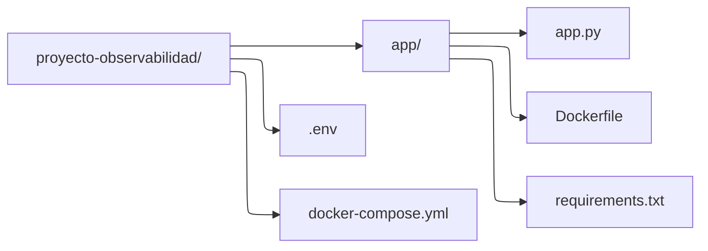
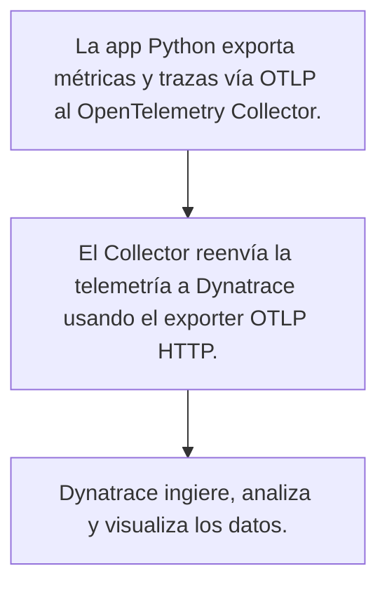

# Proyecto Observabilidad

Este proyecto muestra cómo monitorizar una aplicación Python usando OpenTelemetry y enviar las métricas a Dynatrace para visualización y análisis.

## ¿Qué es OpenTelemetry?

OpenTelemetry (OTel) es un proyecto de código abierto que proporciona un estándar y un conjunto de herramientas para recopilar, procesar y exportar datos de telemetría (trazas, métricas y registros) de aplicaciones y sistemas distribuidos.

## ¿Qué es Dynatrace?

Dynatrace es una plataforma global que combina la observabilidad, AIOps y seguridad de aplicaciones en una única solución. Esta plataforma ayuda a los equipos a innovar más rápido, operar de manera más eficiente y mejorar los resultados de negocio. Dynatrace utiliza inteligencia artificial y automatización para proporcionar respuestas precisas y rápidas a los problemas de rendimiento, seguridad y experiencia de usuario en sus aplicaciones y sistemas.

## Estructura del proyecto



### Descripción ampliada de la estructura del proyecto

- **app/app.py**: Aplicación principal de Python instrumentada con OpenTelemetry.

- **app/Dockerfile**: Imagen Docker para la app Python.

- **app/requirements.txt**: Dependencias de Python.

- **.env**: Tocken de API y endpoint de Dynatrace.

- **docker-compose.yml**: Orquestración de contenedores Collector y app.

## Flujo de integración OpenTelemetry + Dynatrace



## Requisitos previos

- Docker y Docker compose instalados.

- Python instalado en el sistema.

- Cuenta y acceso a Dynatrace (para obtener el API Token y el endpoint).

## Modificaciones previas a la ejecución del proyecto

Para poder ejecutar el proyecto, se debe de modificar el fichero ```.env```. Se deben de modificar las dos variables, con tu ```TOKEN``` y tu ```ENDPOINT``` personal.


## Ejecución del proyecto

Necesitamos tener dos terminales. A continuación vamos a ver como ejecutar el proyecto correctamente:

1. En la primera terminal, debemos de general el docker compose con todas las configuraciones.

	```bash
	docker compose up --build
	```

2. En la segunda terminal, debemos de ejecutar la app para que empieze mandar métricas a Dynatrace.

	```bash
	python3 app.py
	```

## Comprobación de estado

- Ver contenedores activos:

	```bash
	docker compose ps
	```

- Ver logs de los servicios:

	```bash
	docker compose logs otel-collector
	```

	```bash
	docker compose logs app-python
	```

## Ver métricas

- URL típica: ```https://<TU_ENTORNO>.live.dynatrace.com/ui/metrics```.

- Crear un nuevo Dashboards y elegir las métricas necesarias, como por ejemplo, ```http.server.requests``` o ```system.memory.usage```.

## Seguridad y gestión de tokens

Se debe de proteger el **token de API** y no subir archivos ```.env``` con secretos a sistemas de control de versiones.

## Solución porblemas comunes

|Problema|Solución|
|--------|--------|
|El contenedor se detiene|Revisar logs|
|No aparecen métricas en Dynatrace|Revisar la configuración de endpoints y variables de entorno|
|Error de tipo de métrica|Asegurarse de usar temporality DELTA|
|El Collector no accede a los logs|Asegúrate de montar los archivos de logs como volúmenes en Docker|
|Métricas no visibles en Data Explorer|Revisa nombres, temporality y logs de ingesta|
"UNSUPPORTED_METRIC_TYPE_MONOTONIC_CUMULATIVE_SUM"|Usa temporality DELTA para los contadores|
|Errores de autenticación|Verifica el token y el endpoint en ```.env```|

## Referencias

- [Dynatrace Docs: Buenas prácticas OpenTelemetry](https://docs.dynatrace.com/docs/ingest-from/opentelemetry/best-practices/traces)

- [Dynatrace Docs: Dashboards](https://www.dynatrace.com/platform/dashboards/)

- [Dynatrace API Docs](https://docs.dynatrace.com/docs/discover-dynatrace/references/dynatrace-api/environment-api/metric-v2/metric-expressions)

- [OpenTelemetry Python](https://opentelemetry.io/docs/languages/python/)

- [Dynatrace OpenTelemetry](https://docs.dynatrace.com/docs/ingest-from/opentelemetry)

- [YouTube: OpenTelemetry con Dynatrace](https://www.youtube.com/watch?v=d_gbZpeZA0Y)

## Buenas prácticas

Se recomienda mantener los contenedores activos, revisar los logs, y seguir las práctgicas recomendadas para instrumentar la app Python.

##  Escenarios avanzados de uso

- **Detección automática de anomalías y análisis de causa raíz** (IA Davis).

- **Alertas**: Configura eventos de métrica para recibir notificaciones ante anomalías o umbrales críticos.

- **SLOs**: Define Objetivos de Nivel de Servicio usando tus métricas.

- **Correlación**: Relaciona métricas con trazas y logs para troubleshooting profundo.

- **Automatización**: Lanza flujos de remediación automática basados en eventos de métrica.

- **API**: Consulta métricas y trazas mediante la API de Dynatrace para reportes externos o integración.

## Gráficas con las métricas recibidas

Aquí se encuentra las gráficas de las métricas recibidas de la app en python creada anteriormente.


